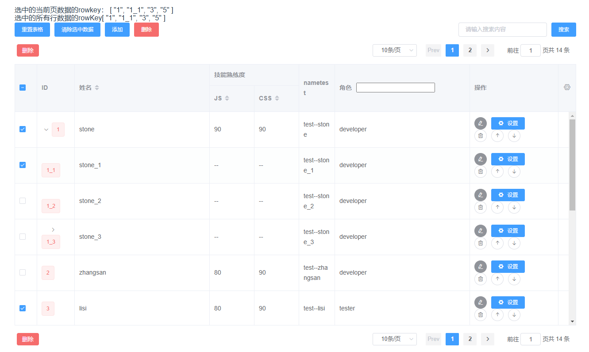

# ll-form-table

基于vue2.6和element-ui的组件库，提供表单组件、表格组件。

以数据驱动视图，将表单、表格由`template`语法转换成`json`语法。通过json配置模板，快速完成表单、表格的开发。

## 本地开发

node版本要求：

node >= 12.0.0 && node <= 14.0.0

### 安装依赖

```
npm install
```

### 运行示例
```
npm run serve
```

## 使用

### 安装

```
npm install ll-form-table
```

### 使用方法

```js
import Vue from 'vue';
import LlUI, { LlFrom, LlTable, LlTableStatic, useTable } from 'll-form-table';

// 全局注册表单
Vue.use(LlForm);

// 全局注册表格
Vue.use(LlTable);
Vue.use(LlTableStatic);

// 当同时注册LlTable和LlTableStatic时，可以使用useTable快捷注册这两个组件
Vue.use(useTable);

// 全部注册
Vue.use(LlUI);
```

### 示例

#### 表单示例

[表单示例代码](./examples/demo/form/SimpleDemo.vue)

```html
<template>
  <ll-form
    :form-items="formItems"
    :model="formData"
    :rules="rules"
    :post-data="submitForm"
    button-position="center"
    label-width="100px"
    class="ll-form-warp"
  ></ll-form>
</template>

<script>
  import { LlForm } from 'll-form-table';
  export default {
    name: 'SimpleDemo',
    components: { LlForm },
    data() {
      return {
        formItems: [
          { type: 'input', label: '账号', prop: 'account' },
          {
            // 通过render和viewRender自定义表单项
            label: 'nickname',
            // labelRender优先级高于label
            labelRender: () => {
              return <span>昵称</span>;
            },
            // prop: 'nickname',
            tips: '请输入昵称',
            render: () => {
              return (
                <el-input
                  type='text'
                  placeholder='昵称'
                  size='small'
                  {...{
                    props: {
                      value: this.formData.nickname
                    },
                    on: {
                      input: val => {
                        this.formData.nickname = val;
                      }
                    }
                  }}></el-input>
              );
            },
            // viewRender优先级大于this.model[prop]
            viewRender: () => <span>{this.formData.nickname}</span>
          },
          {
            type: 'inputNumber',
            label: '年龄',
            prop: 'age',
            formElementProps: {
              // width: 200,
              min: 1,
              max: 200,
              step: 1,
              placeholder: '年龄'
            }
          },
          {
            type: 'select',
            label: '头衔',
            prop: 'title',
            formElementProps: {
              placeholder: '头衔',
              options: [
                { label: 'Tester', value: '3' },
                { label: 'Java developer', value: '2' },
                { label: 'Web Developer', value: '1' }
              ],
              loading: false,
              filterable: true,
              multiple: true
            }
          },
          {
            type: 'input',
            prop: 'edu.highSchool',
            label: '高中'
          },
          {
            type: 'input',
            prop: 'edu.university',
            label: '大学'
          },
          {
            type: 'input',
            label: '数组绑定',
            prop: 'arr.0.value',
            style: { color: 'red' },
            formElementProps: {
              on: {
                change: val => {
                  this.$message.success(`value change:${val}`);
                },
                focus: e => {
                  console.log('focus event', e);
                  this.$message.success('input focus');
                }
              }
            }
          }
        ],
        formData: {
          account: 'stone',
          nickname: 'stone',
          age: 18,
          title: [],
          edu: {
            highSchool: '',
            university: ''
          },
          arr: [{ value: '数组绑定值' }]
        },
        rules: {
          account: [
            { required: true, message: '请输入账号', trigger: 'blur' },
            {
              trigger: 'change',
              validator: (rule, value, callback) => {
                if (/^[a-zA-Z0]+$/.test(value)) {
                  callback();
                } else {
                  callback(new Error('只能输入字母，不能为空'));
                }
              }
            }
          ],
          nickname: [
            { required: true, message: '请输入昵称', trigger: 'change' },
            { min: 3, message: '昵称长度至少为3个字符', trigger: 'change' }
          ]
        },
        formLoading: false
      };
    },
    methods: {
      submitForm(formData) {
        console.log('formData', formData);
        this.formLoading = true;
        return new Promise(resolve => {
          setTimeout(() => {
            this.formLoading = false;
            this.$message.success('提交成功');
            resolve('success');
          }, 1500);
        });
      }
    }
  };
</script>
```

示例渲染结果如下所示：


#### 表格示例

```html
<!--
 * @Author: lianglei stone.ll@qq.com
 * @Date: 2025-04-09 11:02:08
 * @LastEditors: lianglei stone.ll@qq.com
 * @LastEditTime: 2025-04-09 16:13:43
 * @FilePath: \ll-form-table\examples\demo\table\TableStatic.vue
 * @Description: 静态表格
-->
<template>
  <ll-table-static
    ref="table"
    border
    :row-key="'id'"
    :params.sync="params"
    :data.sync="data"
    :columns="columns"
    :action-column="actionColumn"
    :drag-sortable="true"
    drag-sort-model="thead"
    :editable="true"
    :auto-save="false"
    :enter-save="true"
    :disable-h-scroll="true"
    :empty-placeholder="'--'"
    :column-filterable="true"
    :pagination-selectable="true"
    :pagination-props="{
      layout: 'slot, ->, sizes, prev, pager, next, jumper, total',
      prevText: 'Prev'
    }"
    :layout="'tool, pagination, table, pagination'"
    :row-draggable="true"
    :expand-rows.sync="expandRowKeys"
    :fix-height="200"
    :deep-select="false"
    :selection.sync="selections"
    :page-size="10"
    :current-page.sync="currentPage"
    :column-filter-selected="selectedColumns"
    :column-filter-always-selected="['name']"
    custom-table-class="my-table-class"
    @column-reset="handlerFilterReset"
    @selection-change="handlerSelect"
    @row-sort="handlerRowSorted"
    @row-column-confirm="handlerColumnFilterConfirm"
    @cell-change="saveData"
    @data-edit="handlerDataEdit"
  >
    <template slot="tool" slot-scope="{ selection, allSelection }">
      选中的当前页数据的rowkey： {{ selection }}<br />
      选中的所有行数据的rowKey{{ allSelection }}
      <tool-bar
        ref="toolBar"
        :loading="toolBarLoading"
        :keyword.sync="query.keyword"
        @search="handlerSearch"
        @reset="resetTable"
        @clear="clearAllSelection"
        @add="handlerAdd"
        @delete="handlerWarpper(handlerDelete, selection)"
      ></tool-bar>
    </template>

    <template slot="extra">这是附加内容</template>
    <template slot="empty">没有数据</template>
    <template slot="pagination" slot-scope="{ selection }">
      <div>
        <el-button type="danger" @click="handlerWarpper(handlerDelete, selection)">删除</el-button>
      </div>
    </template>
    <template slot="append">这是append插槽内容</template>
    <!-- 操作列操作按钮定义 -->
    <template slot="columnActions">
      <el-button
        type="primary"
        icon="el-icon-s-tools"
        order="2"
        size="mini"
        @click="handlerActionColumnClick"
      >
        设置
      </el-button>
    </template>

    <!-- 模板定义表格列 -->
    <el-table-column prop="nametest" label="nametest" display-weight="150">
      <template slot-scope="{ row }">
        <span class="src-info-value">test--{{ row.name }}</span>
      </template>
    </el-table-column>
  </ll-table-static>
</template>

<script>
  import ToolBar from './ToolBar.vue';
  export default {
    name: 'TableStatic',
    components: { ToolBar },
    data() {
      return {
        expandRowKeys: ['1'],
        selectedColumns: [],
        params: {},
        currentPage: 1,
        selections: ['1', '1_1', '3', '5'],
        data: [
          {
            name: 'stone',
            role: 'developer',
            id: '1',
            js: 90,
            css: 90,
            detail: { id: 'id_1' }, // row-key可配置为detail.id，这样子，detail.id可以作为row-key
            children: [
              { name: 'stone_1', role: 'developer', id: '1_1', detail: { id: 'id_1_1' } },
              { name: 'stone_2', role: 'developer', id: '1_2', detail: { id: 'id_1_2' } },
              {
                name: 'stone_3',
                role: 'developer',
                id: '1_3',
                detail: { id: 'id_1_3' },
                children: [{ name: 'stone_3_1', role: 'developer', id: '1_3_1', detail: { id: 'id_1_3_1' } }]
              }
            ]
          },
          { name: 'zhangsan', role: 'developer', id: '2', js: 80, css: 90, detail: { id: 'id_2' } },
          { name: 'lisi', role: 'tester', id: '3', js: 80, css: 90, detail: { id: 'id_3' } },
          { name: 'wangwu', role: 'designer', id: '4', js: 80, css: 80, detail: { id: 'id_4' } },
          { name: 'wangwu_1', role: 'designer', id: '5', js: 80, css: 80, detail: { id: 'id_5' } },
          { name: 'wangwu_2', role: 'designer', id: '6', js: 80, css: 80, detail: { id: 'id_6' } },
          { name: 'wangwu_3', role: 'designer', id: '7', js: 80, css: 80, detail: { id: 'id_7' } },
          { name: 'wangwu_4', role: 'designer', id: '8', js: 80, css: 80, detail: { id: 'id_8' } },
          { name: 'wangwu_5', role: 'designer', id: '9', js: 80, css: 80, detail: { id: 'id_9' } },
          { name: 'wangwu_6', role: 'designer', id: '10', js: 80, css: 80, detail: { id: 'id_10' } },
          { name: 'wangwu_7', role: 'designer', id: '11', js: 80, css: 80, detail: { id: 'id_11' } },
          { name: 'wangwu_8', role: 'designer', id: '12', js: 80, css: 80, detail: { id: 'id_12' } },
          { name: 'wangwu_9', role: 'designer', id: '13', js: 80, css: 80, detail: { id: 'id_13' } },
          { name: 'wangwu_10', role: 'designer', id: '14', js: 80, css: 80, detail: { id: 'id_14' } }
        ],
        columns: [
          {
            label: 'ID',
            prop: 'id',
            order: 10,
            displayWeight: 2,
            render: (h, { row }) => {
              return parseInt(row.id) > 5 ? (
                <el-tag type='success'>{row.id}</el-tag>
              ) : (
                <el-tag type='danger'>{row.id}</el-tag>
              );
            }
          },
          { type: 'selection', width: 50 },
          {
            type: 'index',
            width: 50,
            label: '#',
            displayWeight: 1,
            header: function() {
              return <div>#$</div>;
            }
          },
          {
            label: '姓名',
            prop: 'name',
            order: 11,
            minWidth: 300,
            sortable: true,
            editable: true
            // 自己实现表格可编辑
            // render: (h, row) => {
            //   return (
            //     <el-input vModel={row.name}></el-input>
            //   );
            // }
          },
          {
            label: '角色',
            prop: 'role',
            minWidth: 300,
            displayWeight: 4,
            editable: true,
            clickEdit: true, // 点击单元格触发编辑
            editorFormatter: val => val, // 编辑内容格式化
            header: () => {
              // (h, scopr) 可以通过scope获得相关信息
              return (
                <div>
                  <label>角色</label>
                  <input
                    type='text'
                    {...{
                      props: { value: this.query.keyword },
                      on: {
                        input: e => {
                          this.query.keyword = e.target.value;
                          // todo，执行你的筛选逻辑，前端搜索、后端搜索；或者观察'search'来执行搜索
                        },
                        click: function(e) {
                          e.stopPropagation(); // 点击输入框不触发排序
                        }
                      },
                      style: {
                        marginLeft: '10px'
                      }
                    }}></input>
                </div>
              );
            }
          },
          {
            label: '技能熟练度',
            prop: 'skill',
            minWidth: '300px',
            displayWeight: 3,
            order: 12,
            children: [
              // 子列没order属性
              { label: 'JS', prop: 'js', sortable: true, minWidth: '100px' },
              { label: 'CSS', prop: 'css', sortable: true, minWidth: '100px' }
            ]
          }
        ],
        actionColumn: {
          props: {
            label: '操作', // 可不传，默认值为‘操作’
            width: '200px'
          },
          // 操作按钮
          buttons: [
            {
              order: 1,
              icon: 'el-icon-edit',
              type: 'info',
              label: '',
              // 控制el-button的属性
              props: {
                // 上面的icon和type属性可不设置，在这里设置
                circle: true,
                type: 'info',
                icon: 'el-icon-edit',
                size: 'mini'
              },
              handler: ({ row }) => {
                this.$emit('edit', row);
              }
            }
          ],
          // 渲染函数，精确控制操作按钮
          render: (h, scope) => {
            const { row, $index } = scope;
            return (
              <div>
                <el-button
                  size='mini'
                  icon='el-icon-delete'
                  circle
                  {...{
                    on: {
                      click: () => {
                        this.$emit('delete', row);
                      }
                    }
                  }}
                />
                <el-button
                  size='mini'
                  icon='el-icon-top'
                  title='上移'
                  circle
                  {...{
                    on: {
                      click: () => {
                        this.handleClickMove('up', row, $index);
                      }
                    }
                  }}
                />
                <el-button
                  size='mini'
                  icon='el-icon-bottom'
                  title='下移'
                  circle
                  {...{
                    on: {
                      click: () => {
                        this.handleClickMove('down', row, $index);
                      }
                    }
                  }}
                />
              </div>
            );
          }
        },
        query: { keyword: '' },
        toolBarLoading: {
          deleteLoading: false,
          searchLoading: false
        }
      };
    },
    watch: {
      data(d) {
        console.log('data change', d);
      }
    },
    created() {
      this.$on('delete', this.handlerDelete);
    },
    methods: {
      handlerWarpper(func, scope) {
        return func.call(this, scope);
      },
      handlerSearch(nameSearch) {
        console.log('handerSearch', nameSearch);
        this.$message.success('keyword:' + nameSearch);
        this.query = nameSearch;
        this.search();
      },
      handlerAdd() {
        this.$emit('add');
        this.$message.success('trigger add');
      },
      handlerDelete(keys) {
        console.log('handlerDelete', keys);
        const newDatas = this.data.filter(item => {
          return !keys.includes(item.key);
        });
        this.data = newDatas;
        this.$$message.success('trigger delete:' + JSON.stringify(keys));
      },
      handlerSortChange({ prop, order }) {
        this.query.headSort = prop;
        this.query.headSortType = order && order.replace('ending', '');
        this.search();
      },
      handlerClickMove(...args) {
        this.$refs.table.rowClickSort(...args);
      },
      handlerRowSorted(data, options) {
        console.log('rowSorted', data, options);
        const { behavior } = options;
        // 节点提升
        if (behavior === 1) {
          this.$confirm('确定提升节点吗？', '提示', {
            confirmButtonText: '确定',
            cancelButtonText: '取消',
            type: 'warning'
          })
            .then(() => {
              this.$message.success('节点提升了');
            })
            .catch(() => {
              this.$message.info('取消节点提升');
              this.$refs.table.revertTableData();
            });
        }
      },
      search() {
        this.$refs.table.doRequest(this.query);
      },
      customStyle({ columnIndex }) {
        if (columnIndex === this.columns.length) {
          return {
            'border-right': '0'
          };
        }
      },
      handlerTableEdit(data) {
        console.log('data edited', data);
        this.data = data;
      },
      handlerFilterReset(selectedColumnProps) {
        console.log('filter reset', selectedColumnProps);
      },
      handlerColumnFilterConfirm(checked) {
        console.log('filter confirm', checked);
      },
      handlerSelect(rows) {
        console.log('selected change', rows);
      },
      saveData(val, prop, row) {
        console.log('cell change', val, prop, row);
        // todo
      },
      handlerDataEdit(tableData) {
        console.log('data edit', tableData);
      },
      handlerActionColumnClick(scope) {
        console.log('action column click', scope);
      },
      resetTable() {
        this.$refs.table.resetTable();
      },
      clearAllSelection() {
        this.$refs.table.clearAllSelection();
      }
    }
  };
</script>

<style lang="scss" scoped>
  ::v-deep .ll-table__table {
    margin: 15px 0;
  }
</style>
```

[表格示例代码](./examples/demo/table/TableStatic.vue)

渲染结果如下所示：

