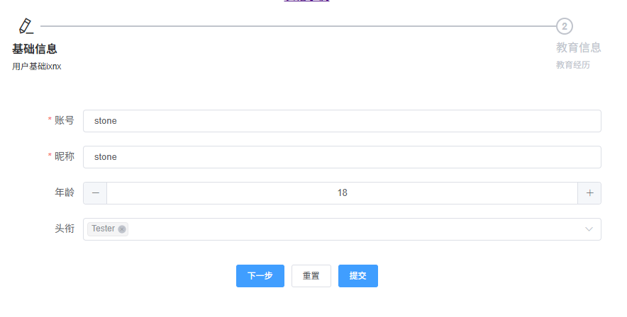

<!--
 * @Author: lianglei stone.ll@qq.com
 * @Date: 2025-04-10 09:02:36
 * @LastEditors: lianglei stone.ll@qq.com
 * @LastEditTime: 2025-04-14 17:08:05
 * @FilePath: \ll-form-table\docs\form.md
 * @Description: 表单使用文档
-->
# LlForm

- [1．概述](#1﹣概述)
- [2．快速上手](#2﹣快速上手) 
  - [2.1 引入element-ui](#21﹣引入element-ui) 
  - [2.2 完整引入](#22﹣完整引入) 
  - [2.3按需引入](#23﹣按需引入) 
- [3．注册ll-form](#3﹣注册ll-form) 
- [4．用法介绍](#4﹣用法介绍) 
  - [4.1，通过模板定义表单项](#41﹣通过模板定义表单项)
  - [4.2．通过formItems配置对象定义表单](#42﹣通过formItems配置对象定义表单) 
  - [4.3．混合定义表单](#43﹣混合定义表单) 
- [5．表单详解](#5﹣表单详解) 
  - [5.1．如何通过formItems配置表单项](#51﹣如何通过formItems配置表单项) 
    - [5.1.1. formItems的数据结构说明](#511-formItems的数据结构说明) 
    - [5.1.2．表单项render渲染函数](#512﹣表单项render渲染函数) 
      - [5.1.2.1．通过labelRender渲染函数自定义表单项1abel](#5121﹣通过1abelRender渲染函数自定义表单项label) 
    - [5.1.3．注册自定义的UI渲染类型](#513﹣注册自定义的UI渲染类型) 
      - [5.1.3.1. addUIType](#5131-addUIType) 
      - [5.1.3.2. addUITypes](#5132-addUITypes) 
    - [5.1.4．异步获取表单值回填表单](#514﹣异步获取表单值回填表单) 
    - [5.1.5．动态绑定表单项的值](#515﹣动态绑定表单项的值) 
    - [5.1.6．动态获取表单项的可选值](#516﹣动态获取表单项的可选值) 
    - [5.1.7．下拉选框el-select组件支持远程搜索](#517﹣下拉选框el-select组件支持远程搜索) 
    - [5.1.8．动态增减表单项](#518﹣动态增减表单项) 
    - [5.1.9．给表单项设置气泡提示](#519﹣给表单项设置气泡提示) 
    - [5.1.10．分步表单](#5110﹣分步表单) 
    - [5.1.11．表单项值的联动](#5111﹣表单项值的联动) 
    - [5.1.12，设置隐藏字段](#5112﹣设置隐藏字段) 
    - [5.1.13．表单查看模式自定义表单项展示内容](#5113﹣表单查看模式自定义表单项展示内容) 
    - [5.1.14．表单嵌套](#5114﹣表单嵌套) 
    - [5.1.15．不展示表单项label](#5115﹣不展示表单项label) 
    - [5.1.16．自定义表单项label](#5116﹣自定义表单项1abel) 
    - [5.1.17．将表单绑定值转为FormData](#5117﹣将表单绑定值转为FormData) 
  - [5.2．表单校验](#52﹣表单校验) 
    - [5.2.1. registerValidateType校验类型注册函数](#521-registerValidateType校验类型注册函数)
    - [5.2.2.validator基于正则的校验函数](#522-validator基于正则的校验函数) 
  - [5.3．如何提交表单数据](#53﹣如何提交表单数据) 
    - [5.3.1．通过给post-data属性配置一个回调函数实现](#531﹣通过给post-data属性配置一个回调函数实现) 
    - [5.3.2．通过监听submit事件实现](#532﹣通过监听submit事件实现) 
    - [5.3.3．自定义表单操作栏来实现](#533﹣自定义表单操作栏来实现) 
    - [5.3.4．通过给post-data属性配置一个数据提交接口来实现](#534﹣通过给post-data属性配置一个数据提交接口来实现)
    - [5.3.5，编辑模式时不提交不可编辑的表单项的值](#535﹣编辑模式时不提交不可编辑的表单项的值) 
    - [5.3.6．编辑模式时不提交值未改变的表单项的值](#536﹣编辑模式时不提交值未改变的表单项的值) 
    - [5.3.7．回车提交表单](#537﹣回车提交表单)
  - [5.4．自定义表单按钮](#54﹣自定义表单按钮) 
    - [5.4.1．表单按钮属性](#541﹣表单按钮属性) 
  - [5.5，表单查看模式](#55﹣表单查看模式) 
  - [5.6．表单项分组](#56﹣表单项分组) 
  - [5.7．默认的提交按钮不可点击](#57﹣默认的提交按钮不可点击) 
  - [5.8．部分表单项组件说明](#58﹣部分表单项组件说明) 
    - [5.8.1．上传组件upload](#581﹣上传组件upload)
- [6．组件属性说明](#6﹣组件属性说明)
- [7. 组件事件说明](#7﹣组件事件说明)
- [8．组件插槽说明](#8﹣组件插槽说明)

===========

## 1. 概述

> 基于`Element-ui 2.x`的一个易用、可自定义的表单组件，你可以像使用`el-form`一样使用本组件，支持全部原生功能和属性

> 组件基于［`element-ui`](http://element-cn.eleme.io/2.0/#/zh-CN)封装，是它的高阶组件

组件的目标在于简化表单创建，快速创建表单，减少重复性工作。

组件亮点：

- **通过form-items属性配置表单项，可快速创建表单**
- **支持模板和form-items混合配置表单项**
- **将element-ui的表单项类型抽象成配置对象的type属性，快速定义表单项渲染类型**
- **通过fetchData配置项异步获取表单项的值并回填**
- **通过fetchOptions异步获取下拉框的可选值**
- **提供了registerValidateType(type, regexp, errorMsg)方法对校验type进行扩展** 
- **可通过addUIType(uiType, dataObject)和addUITypes(uiTypeItems)方法注册表单项渲染类型**
- **支持编辑模式和查看模式**

## 2．快速上手

::: warning 注意
请先安装[Vue 2.x](https://cn.vuejs.org/)和[Element-ui 2.x](http://element-cn.eleme.io/2.0/8/zh-CN)。
:::

### 2.1 引入element-ui

强依赖组件，使用`ll-form`时必须注册下列组件：

- el-from 
- el-form-item 
- el-button 
- el-row 
- el-collapse 若要使用表单项分组功能则需要注册
- el-col 
- el-collapse-item 若要使用表单项分组功能则需要注册
- el-steps 若要使用分步表单则需要注册
- el-tooltip 若要配置tips属性则需要注册该组件
- el-step 若要使用分步表单则需要注册

依赖指令`v-loading`(Loading)，使用时必须注册该指令

```js
Vue.use(Loading.directive);
Vue.prototype.$loading = Loading.service;
```

使用了`Message`，使用时必须添加到`Vue`原型将其作为实例方法供组件实例调用

```js
Vue.prototype.$message = Message;
```

支持`element-ui`的所有表单项组件，按需注册，使用前确保注册了该组件。

### 2.2 完整引入

```js
import Vue from 'vue';
import ElementUI from 'element-ui';
import 'element-ui/lib/theme-chalk/index.css';

Vue.use(ElementUI);
```

### 2.3 按需引入

参见element-ui文档。

## 3. 注册ll-form

```js
import { LlForm} from 'll-form-table';

// 方式1，全局注册
Vue.use(LlForm);
// or
Vue.component(LlForm.name, LlForm);

// 方式2，局部注册
export default {
  components: { LlForm }
}
```

## 4. 用法介绍

### 4.1 通过模板定义表单项

和`el-form`一致，参见官方文档。

### 4.2 通过formItems配置对象定义表单

组件提供了`form-items`属性，用于配置表单项。详细的配置项参见下方的[如何通过formItems配置表单项](#如何通过formitems配置表单项)。

::: tip
注意`formElementProps`对象里面的属性，如果在官方文档里面有中划线(-)，形如`is-range`，配置的时候应该写成`isRange`。
:::

eg:

```html
<template>
  <ll-form
    :form-items="formItems"
    :rules="rules"
    :model="formData"
    label-width="80px"
  ></ll-form>
</template>

<script>
export default {
  name: 'FormDemo',
  data() {
    return {
      formItems: [
        { type: 'input', prop: 'name', label: '姓名' },
        { 
          type: 'select', 
          prop: 'role', 
          label: '角色', 
          formElementProps: {
            isMultiple: true, 
            options: [{ label: 'Developer', value: 1 }, { label: 'Tester', value: 2 }],
            on: {
              change: v => {
                console.log(v);
              }
            }
          } 
        }
      ],
      formData: { name: 'stone', role: 'developer' },
      rules: {
        name: [
          { required: true, message: '请输入姓名', trigger: 'blur' }
        ],
        role: [{ required: true, message: '请选择角色', trigger: 'change' }]
      }
    }
  }
}
</script>
```

### 4.3 混合定义表单

混合定义表单时通过`form-items`属性定义的表单项排在前面，不支持表单项排序。

```html
<template>
  <ll-form
    :form-items="formItems"
    :rules="rules"
    :model="formData"
    label-width="80px"
  >
    <el-form-item label="工龄" prop="workAge">
      <el-input v-model="formData.workAge" />
    </el-form-item>
  </ll-form>
</template>
<script>
export default {
  name: 'FormDemo',
  data() {
    return {
      formItems: [
        { type: 'input', prop: 'name', label: '姓名' },
        { 
          type: 'select', 
          prop: 'role', 
          label: '角色', 
          formElementProps: {
            isMultiple: true, 
            options: [{ label: 'Developer', value: 1 }, { label: 'Tester', value: 2 }],
            on: {
              change: v => {
                console.log(v);
              }
            }
          } 
        }
      ],
      formData: { name: 'stone', role: 'developer' },
      rules: {
        name: [
          { required: true, message: '请输入姓名', trigger: 'blur' }
        ],
        role: [{ required: true, message: '请选择角色', trigger: 'change' }]
      }
    }
  }
}
</script>
```

## 5. 表单详解

### 5.1 如何通过formItems配置表单项

#### 5.1.1 formItems的数据结构说明

```ts
let formItems = FormItem[];

interface FormItem {
  // 扩展的属性
  type: FormItemType; // 表单元素类型
  order?: Number, // 排序，升序排列
  tips?: String, // 气泡提示内容
  span?: Number, // 占用的格数，取值范围1-24，默认24（占满一行）
  render?: Function, // 自定义渲染函数
  viewRender?: Function, // 查看模式时，自定义表单项值的展示，优先级高于this.model[prop]
  labelRender?: Function, // 自定义label的渲染函数
  showLabel?: Boolean, // 是否显示label，默认true，优先级高于表单属性show-label
  display?: Boolean | Function(formData: Object): Boolean, // 是否显示该表单项，默认true
  visible?: Boolean | Function(formData: Object): Boolean, // 是否显示该表单项，需要渲染dom但不展示出来，和style的visibility功能相同
  effects?: Array<String>, // 当前字段值的变化会对哪些字段的值或可选项产生影响
  fetchData?: Function(): Promise<String|Number|Array|Object>, // 通过接口获取表单数据
  fetchOptions?: Function(): Promise<Array>, // 通过接口获取选项型的表单项的可选数据
  formElementProps?: FormItemConfig, // 表单项组件的props
  indent?: Number = 40, // 分组表单，表单分组的缩进距离，type="group"时生效
  expand?: Boolean = true, // 分组表单，是否展开，默认展开，type="group"时生效
  getUploadResponseValue?: Function(res: Object): any = function(res) { return res.data }, // 上传组件，文件上传成功时对接口返回的值进行处理，返回一个值，这个值会作为表单项的绑定值，type="upload"时生效
  children?: Array<FormItem>, // 子表单项，type="group" | "step"时生效，分步表单和分组表单可用
  // 分步表单特有的属性，type="step"时生效
  title?: String, // 步骤名称，参见el-step的title属性
  description?: String, // 步骤描述信息，参见el-step的description属性
  icon?: String, // 步骤图标，参见el-step的icon属性
  status?: String, // 步骤状态，参见el-step的status属性
  // 原生的el-form-item组件支持的属性，参见https://element.eleme.cn/#/zh-CN/component/form#form-item-attributes
  prop: String,
  label: String,
  labelWidth?: String,
  required?: Boolean,
  rules?: Object,
  error?: String,
  showMessage?: Boolean,
  inlineMessage?: Boolean,
  size?: 'medium' | 'small' | 'mini',
  // 支持对el-form-item配置vue组件属性对象
  attrs?: Object,
  props?: Object, // 会和单独定义的form-item的属性合并，单独设置的属性优先级高，如：{prop: 'test, props: {test: 'newTest'} }合并成{ prop: 'text' }
  domProps?: Object,
  class?: String | Array<String> | Object,
  style?: String | Array<String> | Object,
  on?: Object,
  nativeOn?: Object,
  key?: String | Number,
  ref?: String,
  slot?: String,
  scopedSlots?: Object,
  directives?: Array<Object>,
  refInFor?: Boolean
};

// 表单项支持的表单元素类型，element-ui支持的表单项类型和派生的类型
declare type FormItemType = 'input' | 
  'inputNumber' | 
  'textarea' | 
  'select' | 
  'switch' | 
  'radio' | 
  'radioGroup' | 
  'radioGroupButton' | 
  'checkbox' | 
  'checkboxGroup' | 
  'checkboxGroupButton' | 
  'cascader' | 
  'slider' | 
  'timeSelect' | 
  'timePicker' |
  'timeRangePicker' | 
  'datePicker' |
  'datesPicker' |
  'yearPicker' |
  'monthPicker' |
  'dateRangePicker' |
  'dateTimePicker' |
  'dateTimeRangePicker' |
  'upload' | 
  'rate' | 
  'colorPicker' |
  'transfer' |
  // 下面的类型不作为表单项UI类型使用
  'group' | // 表单分组类型，和上面的类型不同，不是特定的UI类型，用于表面这是一个表单项的分组节点，用于包裹表单项
  'step' // 标记未分步表单的步骤 

// 表单元素配置信息
interface FormItemConfig {
  width?: string | number, // 表单元素宽度，未设置时该值会从组件的width属性继承。组件width属性的默认值为100%，即占满整行
  options?: Array<Object|String>, // 选项类型的表单元素的可选项，如select、radio、checkbox等支持配置该属性
  // 支持对el-input配置vue组件属性对象
  class?: Object | String | Array, // 配置el-input组件的class属性
  style?: Object | String | Array,
  attrs?: Object,
  props?: Object, // 会和单独定义的form-item的属性合并，单独设置的属性优先级高，如：{prop: 'test, props: {test: 'newTest'} }合并成{ prop: 'text' }
  domProps?: Object, // 配置el-input组件的dom属性，如：{autocomplete: 'off'}
  on?: Object,
  nativeOn?: Object,
  key?: String | Number,
  ref?: String,
  slot?: String,
  scopedSlots?: Object,
  directives?: Array,
  refInFor?: Boolean,
  // 其它表单元素支持的属性，参见各个表单元素的文档的Attributes部分
}
```

组件将`FormItemType`的可选值通过`UITypes`进行了导出，可通过`import { UITypes } from 'll-form-table'`导入使用。

通过`type`和`formElementProps`配置表单项的示例：参见[4.2 通过formItems配置对象定义表单](#42-通过formitems配置对象定义表单)

表单对部分表单项进行了扩展，详情参见：[5.8 部分表单项组件说明](#58-部分表单项组件说明)

#### 5.1.2 表单项render渲染函数

通常使用`type`属性选择组件支持的表单项类型并通过`formElementProps`属性配置表单元素的属性就可满足表单项定义的需求。但有时业务场景较复杂，配置项已经不满足需求，这时可以使用`render`渲染函数自定义表单项。

::: tip
`render`的优先级大于`type`表单项类型配置，设置了`render`的表单项将不会使用`type`配置的表单项类型，而是使用`render`渲染函数自定义的表单项，同时`formElementProps`属性将不会生效，因为`render`渲染函数完全控制了表单项的渲染。
`。
:::

eg:

```js
const formItems = [
  {
    prop: 'nickname',
    label: '昵称',
    render: () => {
      return (
        <el-input
          type='text'
          placeholder='昵称'
          size='small'
          {...{
            props: {
              value: this.formData.nickname
            },
            on: {
              input: val => {
                this.formData.nickname = val;
              }
            }
          }}></el-input>
      );
    }
  }
]
```

#### 5.1.3 注册自定义的UI渲染类型

通过`render`自定义渲染表单项的方法能解决自定义表单项的问题，但存在一个问题就是不能复用，必须在每个表单配置项里面配置`render`。

如果希望复用，可以通过注册自定义的UI渲染类型来实现。

提供了`addUIType`和`addUITypes`两个方法来扩展表单组件支持的`type`类型，以便一次注册，全局使用，设置表单配置项的`type`属性即可。

##### 5.1.3.1 addUIType

扩展组件支持的UI type，接受两个参数：

- `uiType: String` UI类型的名称
- `render: Function(h, dataObj: Object): jsx` UI类型的渲染函数，render函数接受两个参数：h为Vue的createElement函数，dataObj为表单项配置信息对象，返回值是UI类型的jsx。

##### 5.1.3.2 addUITypes

批量扩展组件支持的UI types，接受一个对象数组作为参数：

- `uiTypes: Array<{ uiType: String, render: Function(h, dataObj: Object): jsx }>` UI类型的名称和渲染函数的集合

eg:

```js
import { addUIType, addUITypes } from 'll-form-table';

addUIType('my-input', (h, dataObj) => {
  return <custom-input {...dataObj}></custom-input>
});

// 批量注册UI类型
addUITypes([
  { uiType: 'my-input', render: (h, dataObj) => <custom-input {...dataObj}></custom-input> },
])
```

#### 5.1.4．异步获取表单值回填表单

从接口获取表单的绑定数据，将数据绑定到表单。异步获取并绑定数据的方式有3种：

1、异步获取表单数据，绑定到`model`属性。

eg:

```html
<template>
  <ll-form :formItems="formItems" :model="formData"></ll-form>
</template>

<script>
export default {
  data() {
    formItems: [],
    formData: {}
  },
  created() {
    fetchData().then(data => {
      formData = data;
    })
  }
}
</script>
```

2、通过`get-data`属性传入数据获取函数来获取表单数据并绑定。

::: tip
`get-data`属性配置的函数应通过`Promise`返回一个可绑定对象作为表单数据。
:::

eg:

```html
<template>
  <ll-form :formItems="formItems" :model="formData" :get-data="getData"></ll-form>
</template>

<script>
export default {
  data() {
    formItems: [{ prop: 'name', type: 'input', label: 'name' }],
    formData: {}
  },
  methods: {
    getData() {
      return new Promise(resolve => { name: 'stone' })
    }
  }
}
</script>
```

2、通过`get-data`属性传入接口来获取表单数据并绑定。

::: tip
需要通过`http`属性值配置的`http`实例来发送请求。所以需要先配置`http`实例。

`get-data`属性配置的接口应通过`Promise`返回一个`{ data: Object, code: 0 }`的对象，`data`作为表单数据。
:::

eg:

```html
<template>
  <ll-form :formItems="formItems" :model="formData" :get-data="'/api/user/1'" :http="httpIns"></ll-form>
</template>

<script>
export default {
  data() {
    formItems: [{ prop: 'name', type: 'input', label: 'name' }],
    formData: {}
  }
}
</script>


#### 5.1.5．动态绑定表单项的值

表单项的值是通过接口获取时，可以使用`fetchData`属性配置来从接口获取数据，返回的数据会回填到表单项中。

eg:

```js
const formItems = [
  {
    type: 'customInput',
    label: 'customInput',
    prop: 'name',
    tips: 'customInput',
    fetchData: () => {
      return new Promise(resolve => {
        setTimeout(() => {
          resolve('async data');
        }, 1000);
      });
    }
  }
]
```

#### 5.1.6．动态获取表单项的可选值

对于有options配置项的表单项，如`select,radioGroup,checkboxGroup`等，可通过`fetchOptions`属性动态的从接口获取可选数据。

eg:

```js
const formItems = [
  {
    type: 'select',
    label: '职级',
    prop: 'level',
    span: 12,
    // 通过promise返回可选项
    fetchOptions: () => {
      return new Promise(resolve => {
        setTimeout(() => {
          return resolve([
            { label: 'Tester', value: '3' },
            { label: 'Java developer', value: '2' },
            { label: 'Web Developer', value: '1' },
            { label: 'UI', value: '0' }
          ]);
        }, 2000);
      });
    },
    formElementProps: {
      placeholder: '职级',
      options: [], // init options, nessessary
      class: 'customClassLevel'
    }
  }
]
```

#### 5.1.7．下拉选框el-select组件支持远程搜索

可选项太多时，支持搜索。

eg:

```js
const formItems = [
  {
    type: 'select',
    label: '职级',
    prop: 'level',
    span: 12,
    formElementProps: {
      placeholder: '职级',
      options: [], // init options, nessessary
      class: 'customClassLevel',
      // 支持远程搜索
      remote: true,
      remoteMethod: query => {
        console.log('remoteMethod', query);
        return new Promise(resolve => {
          setTimeout(() => {
            resolve([
              { label: 'Tester', value: '3' },
              { label: 'Java developer', value: '2' },
              { label: 'Web Developer', value: '1' },
              { label: 'UI', value: '0' }
            ]);
          }, 2000);
        });
      }
    }
  }
]
```

#### 5.1.8．动态增减表单项

可通过动态的修改`form-items`属性的绑定值来实现。

eg:

```js
export default {
  data() {
    formItems: []
  },
  created() {
    this.formItems.push({
      type: 'input',
      label: '爱好',
      prop: 'fav',
      span: 24,
      formElementProps: {
        type: 'textarea',
        placeholder: '请输入爱好'
      }
    });
  }
}
```

#### 5.1.9．给表单项设置气泡提示

可通过表单组件的`tips-effect`属性设置气泡主题，可选值有`dark`和`light`。

在表单项配置里面设置`tips`属性来配置提示内容。

eg:

```js
const formItems = [
  tips: '请输入昵称',
  type: 'input',
  label: '昵称',
  prop: 'nickname'
]
```

#### 5.1.10．分步表单

通过表单的`step`属性来开启分步表单，值为`true`时开启。

表单项通过`type='step'`来配置表单为分步表单的一个步骤，使用`children`来定义当前步骤里面的表单项。

通过`step-attrs`属性配置步骤栏组件的属性，可配置属性和`el-steps`的属性一致。

在表单项里面可以配置`el-step`的属性来定义步骤的属性。

eg:

```html
<template>
  <ll-form
    :step="true"
    :step-attrs="stepAttrs"
    :steps-position="'top'"
    :active-step="0"
    :form-items="formItems"
    :model="formData"
    :rules="rules"
    :post-data="submitForm"
    button-position="center"
    label-width="100px"
    class="ll-form-warp"
  ></ll-form>
</template>

<script>
import { LlForm } from 'll-form-table';
export default {
  name: 'SimpleDemo',
  components: { LlForm },
  data() {
    return {
      // el-steps的属性配置
      stepAttrs: {
        space: '100%',
        direction: 'horizontal',
        active: 0, // 优先级高于组件属性active-step配置
        finishStatus: 'success'
      },
      formItems: [
        {
          type: 'step', // 表单为分步表单的一个步骤
          title: '基础信息', // el-step的属性配置
          icon: 'el-icon-edit', // el-step的属性配置
          description: '用户基础ixnx', // el-step的属性配置
          // 当前步骤的表单项
          children: [
            { type: 'input', label: '账号', prop: 'account' },
            {
              type: 'input',
              label: '昵称',
              prop: 'nickname',
              tips: '请输入昵称'
            },
            {
              type: 'inputNumber',
              label: '年龄',
              prop: 'age',
              formElementProps: {
                // width: 200,
                min: 1,
                max: 200,
                step: 1,
                placeholder: '年龄'
              }
            },
            {
              type: 'select',
              label: '头衔',
              prop: 'title',
              formElementProps: {
                placeholder: '头衔',
                options: [
                  { label: 'Tester', value: '3' },
                  { label: 'Java developer', value: '2' },
                  { label: 'Web Developer', value: '1' }
                ],
                loading: false,
                filterable: true,
                multiple: true
              }
            }
          ]
        },
        {
          type: 'step',
          // el-step的属性配置
          title: '教育信息',
          icon: '',
          description: '教育经历',
          children: [
            {
              type: 'input',
              label: '高中',
              prop: 'edu.highSchool',
              formElementProps: {
                placeholder: '高中'
              }
            },
            {
              type: 'input',
              label: '大学',
              prop: 'edu.university',
              formElementProps: {
                placeholder: '大学'
              }
            }
          ]
        }
      ],
      formData: {
        account: 'stone',
        nickname: 'stone',
        age: 18,
        title: [],
        edu: {
          highSchool: '',
          university: ''
        }
      },
      rules: {
        account: [
          { required: true, message: '请输入账号', trigger: 'blur' },
          {
            trigger: 'change',
            validator: (rule, value, callback) => {
              if (/^[a-zA-Z0]+$/.test(value)) {
                callback();
              } else {
                callback(new Error('只能输入字母，不能为空'));
              }
            }
          }
        ],
        nickname: [
          { required: true, message: '请输入昵称', trigger: 'change' },
          { min: 3, message: '昵称长度至少为3个字符', trigger: 'change' }
        ]
      },
      formLoading: false
    };
  },
  methods: {
    submitForm(formData) {
      console.log('formData', formData);
      this.formLoading = true;
      return new Promise(resolve => {
        setTimeout(() => {
          this.formLoading = false;
          this.$message.success('提交成功');
          resolve('success');
        }, 1500);
      });
    }
  }
};
</script>

```

渲染结果如下所示：



#### 5.1.11．表单项值的联动


#### 5.1.12，设置隐藏字段

#### 5.1.13．表单查看模式自定义表单项展示内容


#### 5.1.14．表单嵌套

#### 5.1.15．不展示表单项label


#### 5.1.16．自定义表单项label


#### 5.1.17．将表单绑定值转为FormData


### 5.2．表单校验

#### 5.2.1. registerValidateType校验类型注册函数


#### 5.2.2.validator基于正则的校验函数

### 5.3．如何提交表单数据


#### 5.3.1．通过给post-data属性配置一个回调函数实现

#### 5.3.2．通过监听submit事件实现

#### 5.3.3．自定义表单操作栏来实现

#### 5.3.4．通过给post-data属性配置一个数据提交接口来实现


#### 5.3.5，编辑模式时不提交不可编辑的表单项的值

#### 5.3.6．编辑模式时不提交值未改变的表单项的值

#### 5.3.7．回车提交表单

### 5.4．自定义表单按钮

#### 5.4.1．表单按钮属性

### 5.5，表单查看模式

### 5.6．表单项分组

### 5.7．默认的提交按钮不可点击

### 5.8．部分表单项组件说明

#### 5.8.1．上传组件upload

## 6．组件属性说明

## 7. 组件事件说明

## 8．组件插槽说明